# 데이터베이스 스키마 문서

이 문서는 게임 개발 동아리 플랫폼의 데이터베이스 스키마를 설명합니다.

## 테이블 개요

| 테이블 | 설명 | 관련 기능 |
|--------|------|----------|
| `cohorts` | 기수 관리 | F0 회원 관리 |
| `profiles` | 회원 프로필 (auth.users 확장) | F0 회원 관리 |
| `membership_applications` | 가입 신청서 | F0 회원 관리 |
| `projects` | 게임 프로젝트 | F1 프로젝트 페이지 |
| `project_members` | 프로젝트-회원 관계 | F1, F2 |
| `recruitment_posts` | 팀원 모집 공고 | F2 팀원 모집 |
| `recruitment_applications` | 프로젝트 지원서 | F2 팀원 모집 |
| `milestones` | 프로젝트 마일스톤 | F3 작업 보드 |
| `board_columns` | 칸반 보드 컬럼 | F3 작업 보드 |
| `task_cards` | 작업 카드 | F3 작업 보드 |
| `task_assignees` | 카드 담당자 | F3 작업 보드 |
| `builds` | 게임 빌드 | F4 빌드 공유 |
| `ratings` | 빌드 평점 | F5 피드백 |
| `feedback_comments` | 피드백 코멘트 | F5 피드백 |
| `bug_reports` | 버그 리포트 | F5 피드백 |
| `bug_report_screenshots` | 버그 스크린샷 | F5 피드백 |
| `audit_logs` | 감사 로그 | NFR-S9 보안 |

## Enum 타입

### member_status (회원 상태)
- `pending`: 승인 대기
- `active`: 활동 중
- `dormant`: 휴면
- `withdrawn`: 탈퇴
- `rejected`: 가입 거절

### global_role (전역 역할)
- `admin`: 운영진
- `member`: 일반 동아리원

### project_role (프로젝트 역할)
- `leader`: 프로젝트 리더
- `member`: 팀원

### position_type (포지션)
- `planning`: 기획
- `programming`: 프로그래밍
- `art`: 아트
- `sound`: 사운드

### project_status (프로젝트 상태)
- `planning`: 기획 중
- `recruiting`: 팀원 모집 중
- `developing`: 개발 중
- `completed`: 완료
- `paused`: 보류
- `archived`: 보관됨

### engine_type (게임 엔진)
- `unity`, `unreal`, `godot`, `other`

### build_type (빌드 타입)
- `webgl`: 웹 빌드 (브라우저 플레이)
- `pc`: PC 빌드 (다운로드)

### bug_severity (버그 심각도)
- `critical`, `high`, `medium`, `low`

### bug_status (버그 상태)
- `new`, `confirmed`, `in_progress`, `fixed`, `cannot_reproduce`, `deferred`

## 주요 관계

### 회원 관리
```
auth.users (Supabase 인증)
    └── profiles (1:1)
            ├── cohorts (N:1) - 기수
            └── membership_applications (1:N) - 가입 신청
```

### 프로젝트 관리
```
projects
    ├── project_members (1:N) ─── profiles (N:1)
    ├── recruitment_posts (1:N) ─── recruitment_applications (1:N)
    ├── milestones (1:N)
    ├── board_columns (1:N) ─── task_cards (1:N) ─── task_assignees (N:M)
    └── builds (1:N)
            ├── ratings (1:N)
            ├── feedback_comments (1:N)
            └── bug_reports (1:N)
```

## ER 다이어그램

```mermaid
erDiagram
    %% 회원 관리
    cohorts ||--o{ profiles : "has members"
    profiles ||--o{ membership_applications : "applies"
    
    %% 프로젝트 핵심
    projects ||--o{ project_members : "has"
    profiles ||--o{ project_members : "joins"
    projects ||--o{ recruitment_posts : "has"
    recruitment_posts ||--o{ recruitment_applications : "receives"
    profiles ||--o{ recruitment_applications : "submits"
    
    %% 작업 관리
    projects ||--o{ milestones : "has"
    projects ||--o{ board_columns : "has"
    board_columns ||--o{ task_cards : "contains"
    milestones ||--o{ task_cards : "linked to"
    task_cards ||--o{ task_assignees : "has"
    profiles ||--o{ task_assignees : "assigned"
    
    %% 빌드 및 피드백
    projects ||--o{ builds : "has"
    profiles ||--o{ builds : "uploads"
    builds ||--o{ ratings : "has"
    profiles ||--o{ ratings : "gives"
    builds ||--o{ feedback_comments : "has"
    profiles ||--o{ feedback_comments : "writes"
    builds ||--o{ bug_reports : "has"
    profiles ||--o{ bug_reports : "reports"
    bug_reports ||--o{ bug_report_screenshots : "has"
    
    %% 감사 로그
    profiles ||--o{ audit_logs : "performs"

    cohorts {
        uuid id PK
        varchar name
        date start_date
        date end_date
        text description
    }
    
    profiles {
        uuid id PK,FK "auth.users"
        varchar email
        varchar name
        varchar nickname
        text avatar_url
        position_type primary_position
        engine_type[] engines
        jsonb external_links
        uuid cohort_id FK
        global_role global_role
        member_status status
    }
    
    membership_applications {
        uuid id PK
        uuid user_id FK
        varchar name
        varchar student_id
        position_type desired_position
        text introduction
        application_status status
        uuid reviewer_id FK
        timestamp reviewed_at
        text rejection_reason
    }
    
    projects {
        uuid id PK
        varchar name
        varchar tagline
        text description
        varchar[] genres
        engine_type engine
        project_status status
        text thumbnail_url
        jsonb external_links
        boolean is_board_public
        uuid featured_build_id FK
    }
    
    project_members {
        uuid id PK
        uuid project_id FK
        uuid user_id FK
        project_role role
        position_type position
        timestamp joined_at
        timestamp left_at
    }
    
    recruitment_posts {
        uuid id PK
        uuid project_id FK
        position_type position
        int slots
        text description
        timestamp deadline
        recruitment_status status
    }
    
    recruitment_applications {
        uuid id PK
        uuid recruitment_id FK
        uuid applicant_id FK
        text introduction
        text portfolio_url
        application_status status
        timestamp reviewed_at
    }
    
    milestones {
        uuid id PK
        uuid project_id FK
        varchar name
        text description
        date target_date
        boolean is_completed
    }
    
    board_columns {
        uuid id PK
        uuid project_id FK
        varchar name
        int position
    }
    
    task_cards {
        uuid id PK
        uuid project_id FK
        uuid column_id FK
        uuid milestone_id FK
        varchar title
        text description
        position_type[] position_tags
        date due_date
        int card_order
        uuid created_by FK
    }
    
    task_assignees {
        uuid id PK
        uuid card_id FK
        uuid user_id FK
    }
    
    builds {
        uuid id PK
        uuid project_id FK
        varchar version
        build_type build_type
        build_os target_os
        text release_notes
        text test_request
        varchar storage_key
        bigint file_size
        uuid uploader_id FK
        int download_count
        int play_count
        boolean is_deleted
    }
    
    ratings {
        uuid id PK
        uuid build_id FK
        uuid user_id FK
        int overall_score
        int controls_score
        int graphics_score
        int sound_score
        int difficulty_score
    }
    
    feedback_comments {
        uuid id PK
        uuid build_id FK
        uuid author_id FK
        text content
        uuid parent_id FK
        boolean is_hidden
        text hidden_reason
    }
    
    bug_reports {
        uuid id PK
        uuid build_id FK
        uuid reporter_id FK
        varchar title
        text steps_to_reproduce
        text expected_result
        text actual_result
        bug_severity severity
        bug_status status
        jsonb environment_info
        uuid linked_card_id FK
        boolean is_hidden
    }
    
    bug_report_screenshots {
        uuid id PK
        uuid bug_report_id FK
        varchar storage_key
        varchar file_name
        int file_size
        varchar mime_type
    }
    
    audit_logs {
        uuid id PK
        uuid actor_id FK
        varchar action_type
        varchar target_type
        uuid target_id
        jsonb details
    }
```



## RLS 정책 요약

Row Level Security(RLS) 정책은 PRD 섹션 4.2 권한 매트릭스를 기반으로 구현되었습니다.

### 주요 원칙

1. **로그인 필수**: 모든 테이블은 인증된 사용자만 접근 가능
2. **활성 회원 우선**: 대부분의 조회는 `status = 'active'`인 회원만 허용
3. **프로젝트 역할 기반**: 프로젝트 관련 수정은 리더/팀원 여부에 따라 권한 분리
4. **자기 프로젝트 평점 제한**: F5-3 요구사항에 따라 팀원은 자기 프로젝트 빌드에 평점 불가

### 헬퍼 함수

- `is_active_member()`: 현재 사용자가 활성 회원인지
- `is_admin()`: 현재 사용자가 운영진인지
- `is_project_member(project_id)`: 특정 프로젝트의 팀원인지
- `is_project_leader(project_id)`: 특정 프로젝트의 리더인지
- `is_build_project_member(build_id)`: 빌드가 속한 프로젝트의 팀원인지

## 트리거 및 함수

### updated_at 자동 갱신
모든 주요 테이블에 `BEFORE UPDATE` 트리거가 적용되어 `updated_at` 컬럼이 자동 갱신됩니다.

### 프로젝트 생성 시 기본 컬럼
프로젝트 생성 시 `on_project_created()` 트리거가 기본 칸반 컬럼 4개(할 일, 진행 중, 검토, 완료)를 자동 생성합니다.

## 뷰

### build_rating_stats
빌드별 평균 평점을 계산하는 뷰입니다.

```sql
SELECT build_id, project_id, rating_count, avg_overall, ...
FROM build_rating_stats
WHERE build_id = '...';
```

## TODO / 향후 확장

- [ ] 공지사항 (notices) 테이블
- [ ] 일정 (events) 테이블
- [ ] 알림 (notifications) 테이블 (P1)
- [ ] 프로젝트-행사 연결 (event_projects) 테이블 (P1)
